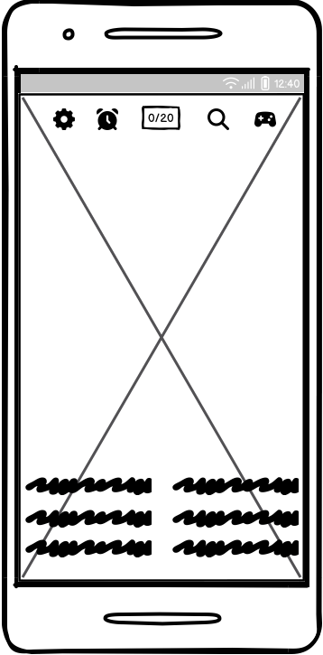
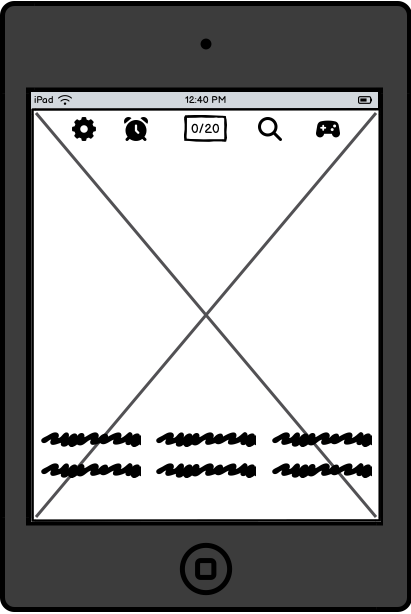
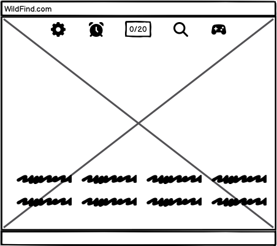

# WildFind

## Get to know us 

As a passionate web developer I love to combine fun with learning through interactive, user-driven experiences. This project showcases how data doesn’t have to be static — it can be explored, played with, and discovered.

My aim is to create a site that’s engaging for users of all ages, while also presenting meaningful information about the natural world. Whether you're here to test your skills, learn about wildlife, or just enjoy a beautifully crafted hidden objects safari game, I hope this experience brings you something new.

This project was built as part of my journey in learning and applying front-end technologies, and it reflects the following values:

📊 Interactive data presentation

🌿 Environmental awareness

🎮 User-centered design

💡 Creative learning experiences

Thanks for exploring with me — and happy finding! 🦁🦓🦒 

## Mockups

### Phones

### Tablets

### Laptop

##  Live Demo

👉 View the website [here]()

## Technologies Used

HTML5

CSS3

JavaScript

JQuery

## GitHub User Story Project

A [project](https://github.com/users/IrinaAdeniyi/projects/5/views/1) containing user stories with acceptance criteria was created in GitHub. This was done to easily organize and prioritize work, as well as defining clear requirements and tracking progress.

## Wireframes

The wireframes for this website were created using [Balsamiq](https://balsamiq.com/education/)

*Disclaimer: The wireframes shown are for demonstration purposes only. The final implementation may vary from these initial representations.

### Smartphone view

### iPad view

### Laptop view

## Building process

I started building my project by creating the structure tree. I then concentrated on the game-area images, which represent the background of the game. I chose to have two themes and challenges. The first theme is **The Big Five** - featuring the African Elephant, African Lion, African Leopard, African Buffalo and the Black Rhinoceros. These animals are five of the most iconic and sought-after animals to see on an African safari. The second theme is **Rainforest Creatures** - featuring the Tree Frog, Blue Morpho Butterfly, Boa Constrictor, Orchid and the Capuchin Monkey. These animals are ideal for learning about tropical ecosystems.

I then proceeded to hide the animals in the two backgrounds. I started with th eblue morpho butterfly. I used a "hidden-object" class, and used the pointer value for the cursor attribute in css to change the cursor to a little hand pointing when the user hover over a hidden object. I used jQuery to make a pop-up appear once a hidden object it's clicked and make it disspear after it is clicked.

## Project Structure

## Features

## Possible future features

## Testing

## Troubleshooting
1. The first issue I encountered was the crossing of the words, once the hidden object is found. Initially it didn't work because I did not wrapped it in the $(document).ready(...) function, to ensure it runs after the page is loaded (i.e. the HTML document has been fully loaded).

2. The second issue I encounter, is again the crossing of the word once the hidden object is found. step one worked initially because I didn't have an icon next to the word. After adding the icons I noticed the crossing was not working anymore. Therefore, I assumed it will be the img tag that interferes with the crossing and I enclosed the text in a span tag. This helped resolve the issue.

## Remaining bugs

## Website checks using validation tools

### Lighthouse scores

**Both the W3C Markup Validator and W3C CSS validator returned no errors.**

## Deployment

## Setup Instructions

## Credits

